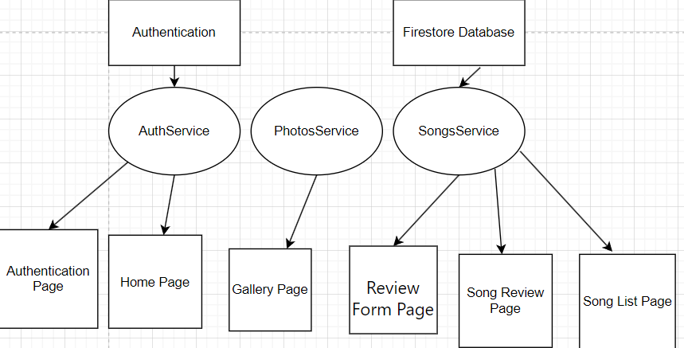

[](https://classroom.github.com/a/HTlAZVnP)
[](https://classroom.github.com/open-in-codespaces?assignment_repo_id=12985456)
# Final Project

**Title:** Song Review App  
**Name:** David Amankwah  
**Student ID:** G00394825  

## Application Function

The Song Review app is a platform for people who love listening to music and reviewers to engage in an expressive review around their love of music. Several features that support user-generated content and music discovery are integrated into the application, resulting in a dynamic environment that encourages users to explore and consider their favorite songs.

<b>Song Browsing: </b>
Users of the application can view song reviews and access a library of songs spanning various genres. Users can browse and explore the vast catalog with the "Browse Songs" feature. Users can edit and delete their reviews.

<b>Song Reviews and Ratings: </b>
Users can share their insights and opinions through detailed song reviews. The "Add Songs Review" functionality empowers users to express their thoughts on various aspects. Users can also assign a rating to the songs, contributing to rankings and highlighting their personal preferences.

<b>Gallary Integration: </b>
To add a visual flair to their musical narratives. Users are able to upload their own photos. Users are encouraged to add images by using the "Add your mood on music" feature, which results in an immersive experience.

<b>User Authentication: </b>
The application implements user authentication to ensure a personalized expericene. Users can create an accounts, log in and access feautres tailored to preferences. The Song-List Page showcase the user reviews, creating a sense of ownership.

<b>Navigation and User-Friendly Interface: </b>
Because of the intuitive design of the interface, users can easily navigate through the application. The application's user-friendly design prioritizes a seamless experience, allowing users to focus on their love for music without unnecessary complexities.

## Running the Application

Provide step by step instructions on how to run your applicaiton. Are there any prerequisite softwares required?

```MARKDOWN
List the instructions step by step
    1. Install Angular CLI - npm install -g @angular/cli
    2. Install firebase tools - npm install -g firebase-tools
    3. Log in to Firebase - firebase login
    4. Install angular fire - ng add @angular/fire
    5. Install Ionic tooling: (if you get an error with the below command run sudo su first then after you execute the command successfully exit)
     - npm install -g @ionic/cli native-run cordova-res
    6. ionic serve
            :
            :
```

## Minimum Project Requirments

Confirm and demonstrate how you have met all minimum project requirments:

* The project, including code and documentaion, will be fully contained in the provied Git repo.
* The project **MUST** contain a working Ionic Angular app which matches the app you chose.
* The Ionic app must include the use of the Angular Router, Connection to a Backend service such as Firebase or Supabase, Use of a Capacitor native plugin.
* The app must not resemble in any way an app you have previously developed for another module or are currently developing for any project. 
* The code MUST compile. 30% grade reduction if code does not compile when I issue the ionic serve command. 
* The application code must be formatted in a consistent and standard way.
* The code must contain comments. One comment per class, method and variable at minimum.
* There must be two commits per week minimum (Note: Should be many commits per day coding).
* The documentation and commentary must be free of a grammar and speling mistakes.

## Project Requirments above and beyond

The application's intuitive interface ensures the users easily navigate through various sections, creating a positive user exprience.

## Application Architecture
The Song Review app is strucutred using the Angular framework with Ionic. The application is organized into different pages, serving a certain purpose. Here is an overview of the main pages, their purpose and the methods they implement.

<b>Home Page: </b>
This page provides a brief introduction to the SongReview app. The "Get Started" button on the page directs users to the Song Review page. Returning to the authentication page by invoking AuthService's "logout" method.

<b>Song Review Page: </b>
This page encourages users to add songs for review, view song reviews and add photo. This page is also a standalone component. Users are directed to the review form via the "navigateToReviewForm()" method. The users are navigated to the gallery via the "navigateToGallary()" method.

<b>Review Form Page: </b>
This page allows users to add new song reviews. The "addSong()" method adds a new song to the collection, calling the "createSong" method from the "SongsService".

<b>Song List Page: </b>
Display a list of songs, including their titles, artists, reviews, and ratings. The "deleteSong(song)" method deletes a song, calling the "deleteSong" method from the "SongsService". The "openUpdateInput(song)" method opens an alert to update song details, calling the "updateSong" method from the "SongsService".

<b>Authentication Page</b>
User authentication is managed by this page, which also handles registration, login, and password resets. The "register()" method register a new user calling the "register" method from the "AuthService". The "login()" method logs in an existing user, calling the "login" method from the "AuthService". The "sendReset()" method sends a password reset email, calling the "resetPw" method from the "AuthService".

<b>Gallery Page:</b>
Allows users to add photos to the gallary. The "addNewToGallery()" method captures a photo and adds it to the gallery, calling the "addNewToGallery" method from the "PhotosService".

<b>Firestore Database: </b>
This is an application utilizes Firestore, to store song data. The "SongsService" interacts with Firestore for CRUD operations on songs objects.

<b>Authentication: </b>
User Authentication is handled by Firebase Authentication, and the "AuthService" communicates with it for user-related functionalities.


The application architecture:



## Roadblocks and Unfinished Functionality

<b>Navigation: </b>

Managing naviagation and route transition was challenging. Careful configuration was required for the navigation transition. Using an Angular Router was the way to guarantee consistent navigation.

<b>UX/UI Challenges: </b>

Ensuring a consistent and user-friendly interface across the pages. Ionic Component was used to try create a responsive design.

<b> Form Validation: </b>

Form validation was complex,especially with dynamic forms. Form Builder allowed for a easy form creation and validation.

<b>Firestore Integration: </b>
Firestore involved managing asynchronous code. Firestore integration was made simpler by using the AngularFirestoreModule and RxJS operators.


## Resources

Provide links to resources used:

* [YouTube](https://www.youtube.com/watch?v=Y0vH5Cm3HAk) - YouTube Tutorial I found helpful